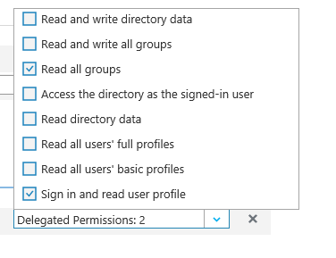
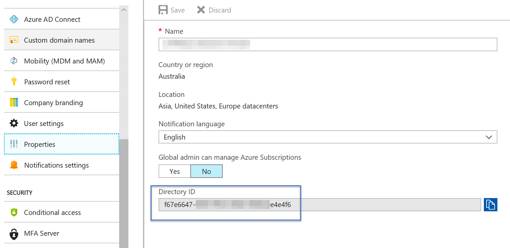
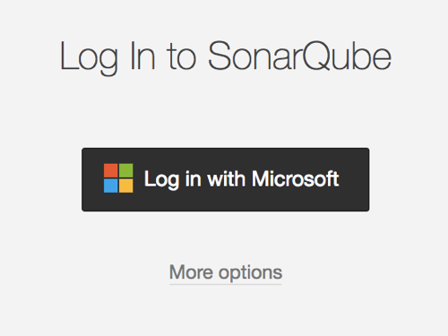
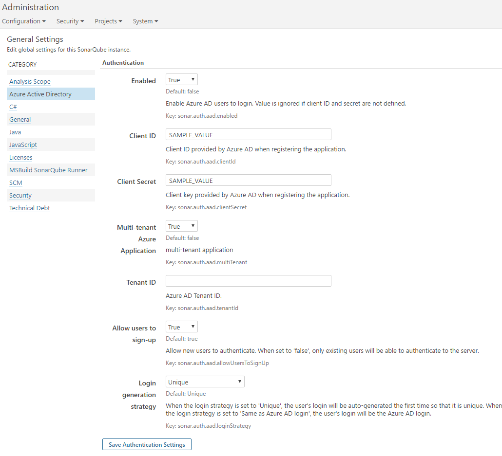
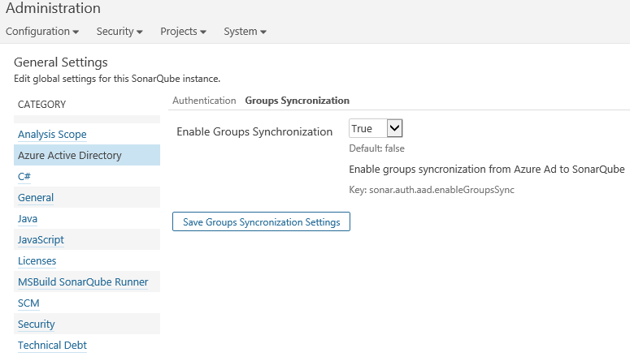

# Azure Active Directory (AAD) Authentication Plug-in for SonarQube #

## Description ##
This plug-in enables Azure Active Directory (AAD) users to automatically be sign up (a login is created if they don’t have one already) and authenticated on a SonarQube server.

## Prerequisites ##

### Enable HTTPS on SonarQube ###
The Azure Active Directory Authentication Plug-in for SonarQube is an OAuth 2.0 provider for SonarQube. For security reasons, HTTP is not supported. HTTPS must be used, by configuring it on the SonarQube server if this is not done already.

`Server base URL` property must be set to this HTTPS URL either by setting the property from SonarQube administration page (General -> Server base URL) or through setting `sonar.core.serverBaseURL` key value in the sonar.properties file.

For more details, on how to setup HTTPS on SonarQube, please see [Securing the Server behind a Proxy](http://docs.sonarqube.org/display/SONAR/Securing+the+Server+Behind+a+Proxy)

### Create Active Directory application under your Azure Active Directory tenant ###

1. Sign in to the [Azure management portal](https://manage.windowsazure.com/).
1. Click **Active Directory** in the left navigation bar.
1. Click the directory where you wish to register the sample application.
1. Click the **Applications** tab.
1. In the drawer at the bottom of the screen, click **Add**.
1. Click **Add an application my organization is developing**.
1. Enter a friendly name for the application, for example `AzureADLoginProviderForSonarQube`, select "**Web Application and/or Web API**", then go to step 2 of the AAD application wizard.
1. For the **Sign-on URL**, enter the base URL for your SonarQube Server, example `https://localhost:9090`. You can change this later as needed.
1. For the **App ID URI**, enter `https://<your_tenant_name>/<your_application_name>` replacing `<your_tenant_name>` with the name of your Azure AD tenant selected in #3 and `<your_application_name>` the name of your application provided in #7. Click **OK** to complete the registration.
1. While you are still in the Azure portal, click the **Configure** tab of your application.
2. In **Reply URL**, remove the existing URL. Add SonarQube Server URL and append `https://<SonarQube_ServerURL>/oauth2/callback`, example `https://localhost:9090/oauth2/callback`
3. Under the **keys** section, create a key for your application with 1 year expiry duration.
4. Under **Permissions to other applications** section, make sure the application has access to **Windows Azure Active Directory**. **Sign in and read user profile** delegated permissions should be selected.

1. If you enabled group syncronization, make sure the application has access to **Windows Azure Active Directory**.  **Read all groups** delegated permissions should be selected.

5. If your application is a single tenant application, you need to provide the tenant id in the provider settings. You can retrieve the tenant id by selecting **View endpoints** at the bottom of the screen and retrieving the id as shown below.

	

1. Make a note of the **Client ID**, **Key**, and **tenant Id**. You will need this later when you configure your application.

> For a more detailed walkthrough, [Create Active Directory application and service principal using portal](https://azure.microsoft.com/en-us/documentation/articles/resource-group-create-service-principal-portal/)

## Installation and configurations ##

### Install Azure AD Authentication plug-in ###

1. Download and Copy **sonar-auth-aad-plugin-1.0-SNAPSHOT** to SonarQube server plugin folder under extensions folder.
2. **Restart** SonarQube Server

### Configure Azure AD Authentication plugin ###
1.  Login to SonarQube with an administration account.
2.  On the main menu, go to **Administration** .
3.  Click **Azure Active Directory** under **Category** menu, and provide the following values:
	1.  Set the **Enabled** property to true
	2.  Set the**Client ID** from the value provided by the Azure AD application.
	2.  Set the **Client Secret** from the value provided by the Azure AD application.
	3.  Set the **Multi-tenant Azure Application** value based on the configuration of the Azure application.
	4.  For a single tenant application, set the **Tenant ID** to the Azure AD tenant Id.
	5.  Set **Login generation strategy** value:
		1.  '***Unique***', the user's login will be auto-generated the first time so that it is unique. 
		2.  '***Same as Azure AD login***', the user's login will be the Azure AD login.
3. Click **Save Authentication Settings**.
4. Sign out and go to the log in form. A new button named "**Log in with Azure AD**" allows users to sign in with their Azure AD account.

	

### General Configurations ###

|Property Key|Property Name|Description|Default value|
|:----------------------|:---------------------:|:--------|:--------:|
|sonar.auth.aad.enabled|Enabled|Enable Azure AD users to log in. Value is ignored if client ID and secret are not defined.|false|
|sonar.auth.aad.clientId.secured|Client ID|Client ID provided by Azure AD when registering the application.|None|
|sonar.auth.aad.clientSecret.secured|Client Secret|Client password provided by Azure AD when registering the application.|None|
|sonar.auth.aad.multiTenant|Multi-tenant Azure Application|Set the value to True if users from other Azure Active Directories can consent to the application and sign in to it. |false|
|sonar.auth.aad.tenantId|Tenant ID|Azure Active Directory Tenant Id. This value is optional if sonar.auth.aad.multiTenant set to True  |None|
|sonar.auth.aad.allowUsersToSignUp|Allow users to sign-up|Allow new users to authenticate. When set to 'false', only existing users will be able to authenticate to the server.|true|
|sonar.auth.aad.loginStrategy|Login generation strategy|When the login strategy is set to '***Unique***', the user's login will be auto-generated the first time so that it is unique. When the login strategy is set to '***Same as Azure AD login***', the user's login will be the Azure AD login. This last strategy allows, when changing the authentication provider, to keep existing users if logins from a new provider are the same as Azure AD).|Unique|

### Groups Syncronization ###

|Property Key|Property Name|Description|Default value|
|:----------------------|:---------------------:|:--------|:--------:|
|sonar.auth.aad.enableGroupsSync|Enable Groups Synchronization|Enable groups syncronization from Azure AD to SonarQube, For each Azure AD group user belongs to, the user will be associated to a group with the same name(if it exists) in SonarQube.|false|

## Additional Configurations ##

1. **Customize Profile Picture**
This can be simply done by linking your email to an existing Gravitar account or by creating a new one. In SonarQube Gravitar support is enabled by default, using gravitar.com. You can configure a different server or disable the feature altogether. Refer to [Look and Feel](http://docs.sonarqube.org/display/SONAR/Look+and+Feel)

1. **Managing AAD users access to SonarQube**
To restrict access to SonarQube to a given group of AAD users, there are currently two ways to do so:
	1. **From SonarQube Server**, set "Allow Users to SignUp" property to False in AAD settings. When set to 'false', only existing local/AAD users will be able to authenticate to the server. SonarQube Administrator can add local users manually to the server. refer to [Authentication](http://docs.sonarqube.org/display/SONAR/Authentication)
	2. **From Azure Active Directory Application settings**, restricting the access to the Azure application you created in "Create Active Directory application under your Azure Active Directory tenant" section. Refer to  [Managing access to apps](https://azure.microsoft.com/en-us/documentation/articles/active-directory-managing-access-to-apps)
